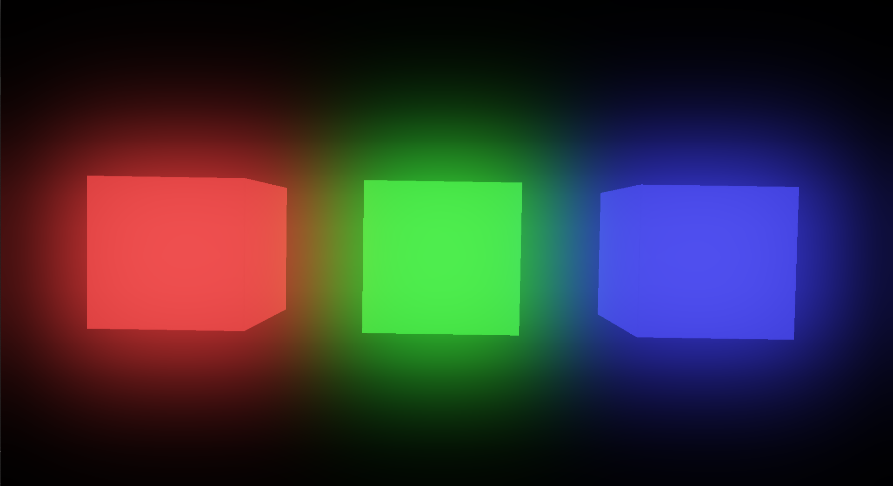
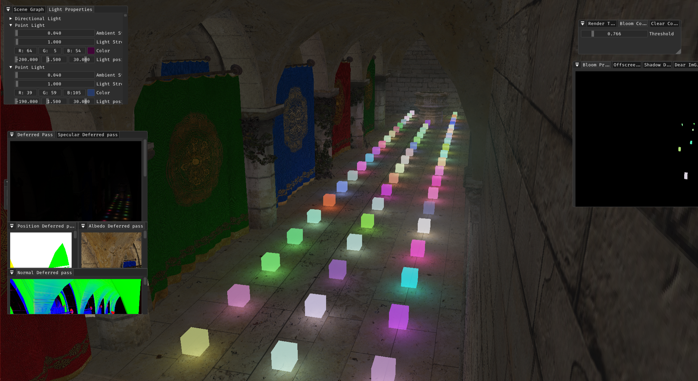
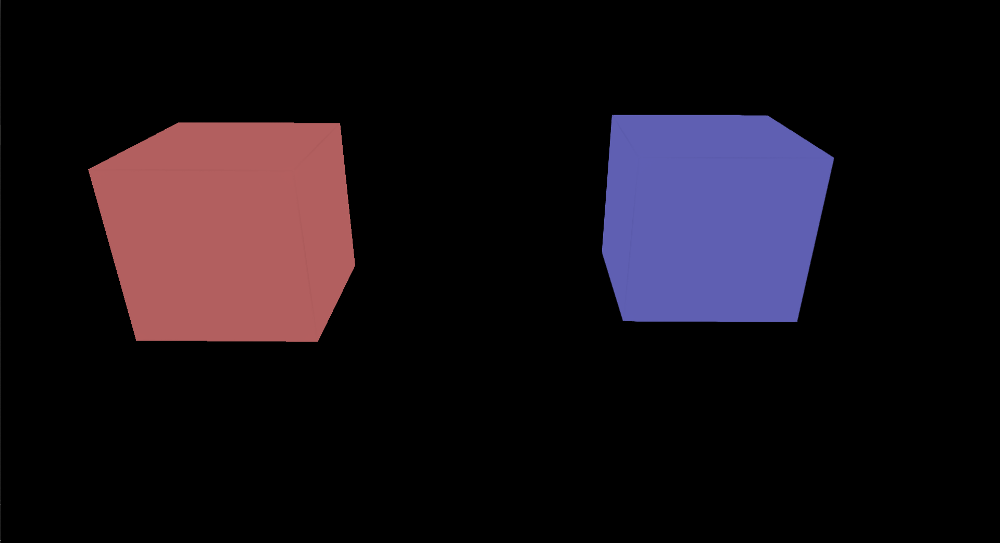

# RadiumEngine

A simple PBR Graphics renderer using C++ / DirectX11.
Made for learning and implementing modern graphics techniques in a quick and easy manner.

# Features

* Physically Based Rendering (PBR)
* Image Based Lighting (IBL)
* Shadow Mapping
* Bloom (Using repeated up / down sampling technique)
* Deferred shading
* Normal mapping
* HDR lighting and tone mapping
* Point and directional lights
* Logging system (Using spdlog)
* FXAA
* Simple UI to configure shader parameters and preview output of various Render Passes.

# Showcase

>Shadow Mapping and Bloom

>Bloom

> PBR and Diffuse IBL

> Deferred Shading
 

> FXAA 
> Without FXAA (Left) | With FXAA (Right)
> 

# Dependencies used

* STB Image 
* Assimp
* ImGUI
* Spdlog
