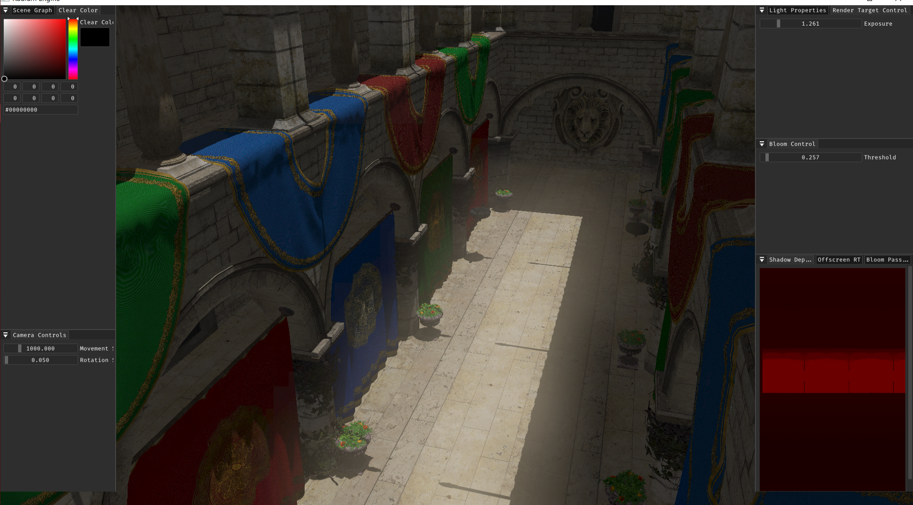

# RadiumEngine

Work in progress PBR Graphics renderer using C++ / DirectX11.
Made for learning and testing modern graphics techniques and the D3D11 Api.

# Samples

>Shadow Mapping and Bloom

> PBR and Diffuse IBL

> Deferred Shading

# Dependencies used
* STB Image
* Assimp
* DearImGUI
