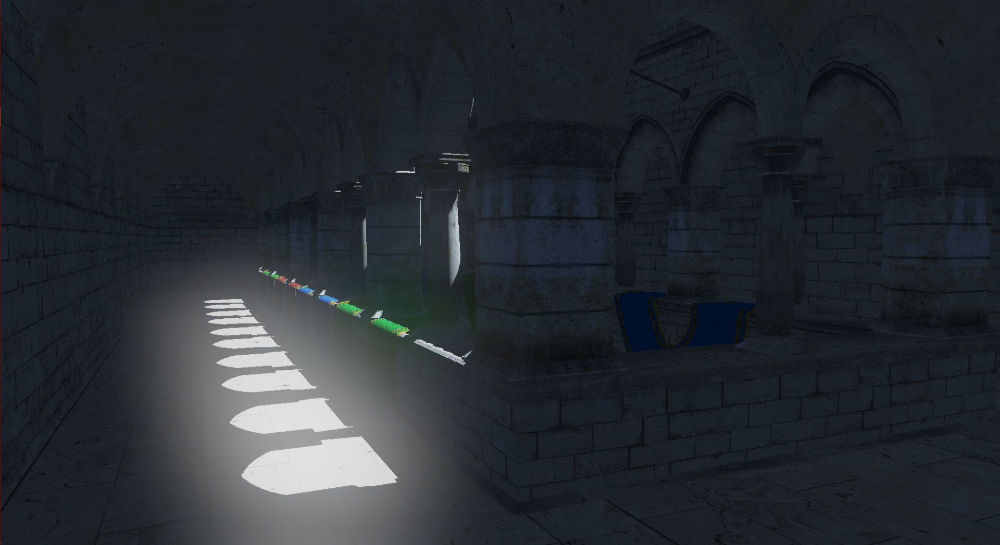
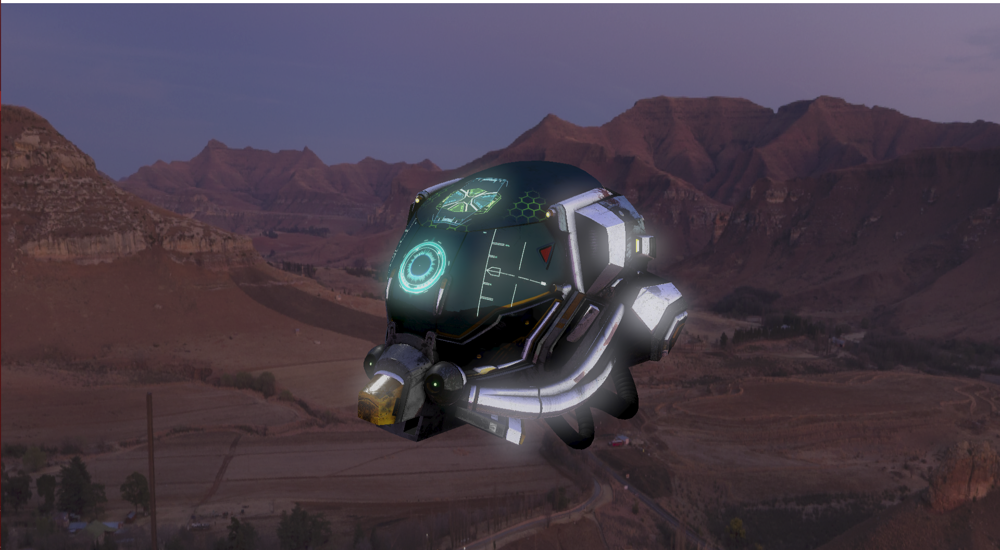
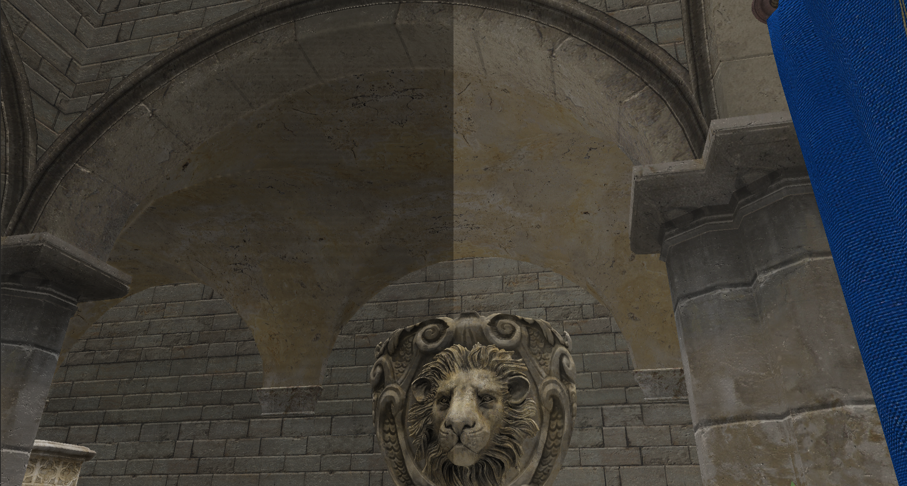

# RadiumEngine

A simple PBR Graphics renderer using C++ / DirectX11.
Made for learning and implementing modern graphics techniques in a quick and easy manner.

# Features

* Physically Based Rendering (PBR)
* Image Based Lighting (IBL)
* Shadow Mapping
* Bloom (Using repeated up / down sampling technique)
* Deferred shading
* Normal mapping
* FXAA
* SSAO
* HDR lighting and tone mapping
* Point and directional lights
* Logging system (Using spdlog)
* Simple UI to configure shader parameters and preview output of various Render Passes.

# Showcase

>Shadow Mapping and Bloom

>Bloom

> PBR and Diffuse IBL

> Deferred Shading
 

> FXAA (Applied on right half)
> 

> SSAO (Applied on left half)
> 
> 

# Dependencies used

* [stb-image](https://github.com/nothings/stb/blob/master/stb_image.h) 
* [assimp](https://github.com/assimp/assimp)    
* [imgui](https://github.com/ocornut/imgui)
* [spdlog](https://github.com/gabime/spdlog)
* [vcpkg - package manager](https://vcpkg.io/)
